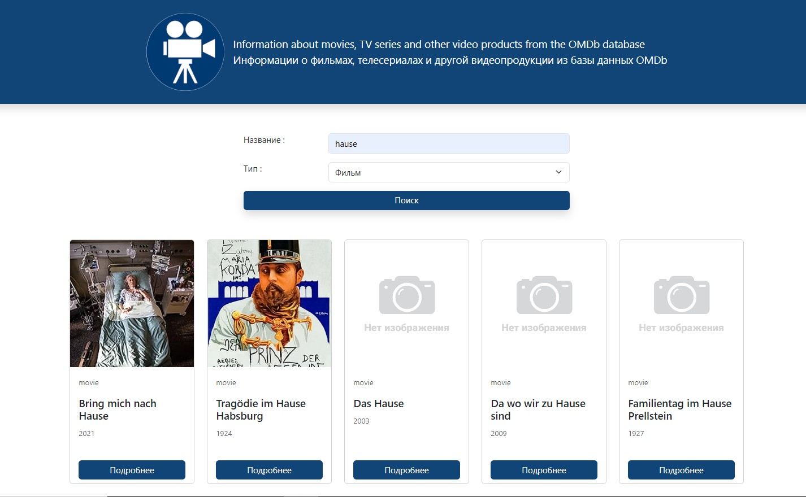
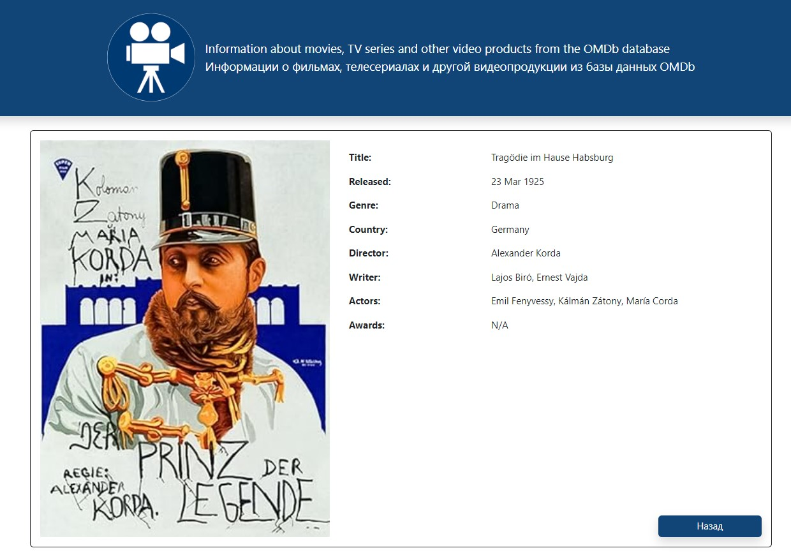

Создание веб-приложений 
с использованием Angular <link rel="icon" type="image/x-icon" href="favicon.ico">
--

Тема: HTTP запросы

Пользователь вводит название фильма, необходимо 
показать короткое и длинное описание фильма. Используется API 
сайта http://www.omdbapi.com/ для получения данных.

### Установка и запуск (VSCode)
Открыть терминал:
Ctrl+j
1. `npm install`
2. `ng serve` (в терминале переходим по ссылке `➜  Local:   http://localhost:4200/`)

### Для prod окружения

Скопируйте файл `cp src/environments/environment.development.ts src/environments/environment.ts`
Замените OMDB_API на свой секретный ключ

---

